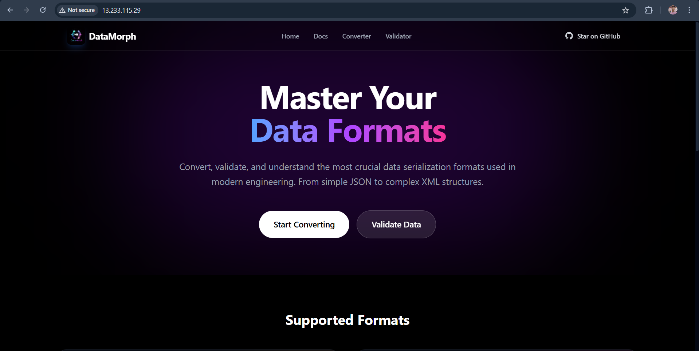
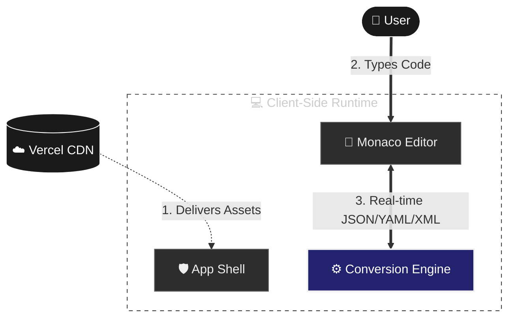
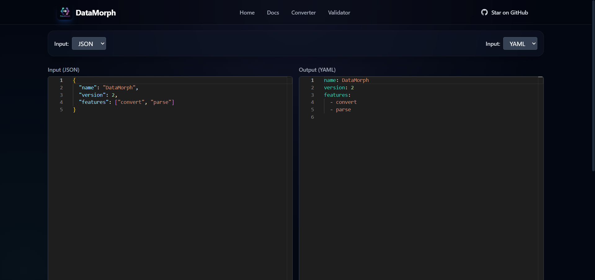
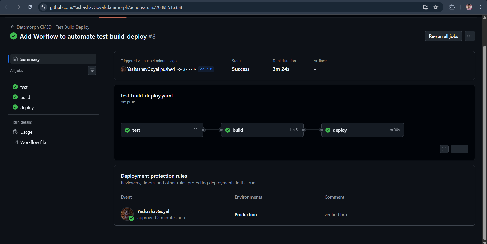
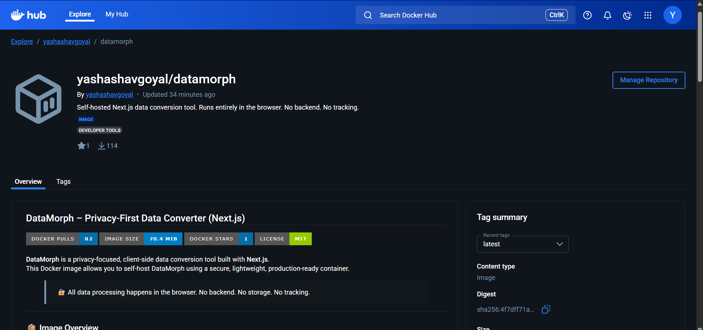
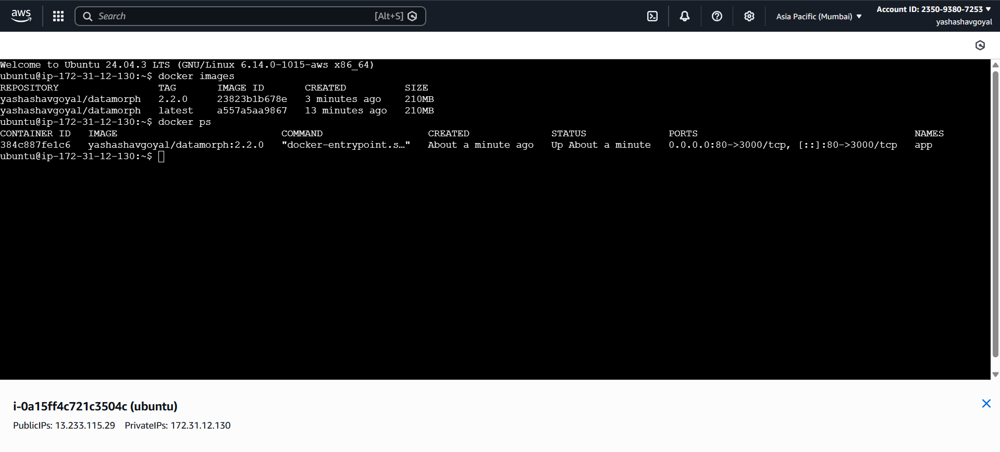

# DataMorph


<div align="center">
  
  <p><em>Deployed on AWS EC2</em></p>
</div>

DataMorph is a privacy-focused developer tool for converting and validating data formats like JSON, YAML, XML, and TOML. It runs entirely in your browser, so your data never leaves your device.

## How It Works

DataMorph uses a **Client-Side Architecture**. It downloads the necessary code once and then processes everything locally on your computer.



## Features

- **Real-Time Conversion**: Instantly convert between formats as you type.
  
- **Privacy First**: 100% client-side processing. Zero data opacity.
- **Validation**: Instant syntax checking for JSON, YAML, XML, and TOML.
  
- **Modern UI**: Dark mode, glassmorphism, and responsive design.

## Future Scope

- **More Formats**: Support for CSV, Protobuf, and GraphQL SDL.
- **File Upload**: Drag-and-drop file conversion.
- **API Generation**: Generate TypeScript interfaces or Go structs from JSON.
- **PWA Support**: Install as a Progressive Web App for offline use.
- **Theme Toggle**: Light/Dark mode switcher.

## 🚀 DevOps & Deployment

We have professionalized the deployment pipeline using **GitHub Actions** and **Docker**, ensuring a robust CI/CD process.

### 🔄 CI/CD Pipeline (GitHub Actions)

Our pipeline fully automates the testing, building, and deployment process:

1.  **Test**: Runs `npm run lint` to ensure code quality.
2.  **Build**: Creates a optimized Docker image using a multi-stage build.
3.  **Deploy**: Automatically deploys the new container to our **AWS EC2** instance upon any push to main or any tag push (vx.y.z) with a manual approval.



### 🐳 Docker Containerization

We use a **Multi-Stage Docker Build** to ensure our production images are:
-   **Lightweight**: Only essential artifacts are copied to the final image (based on `node:20-alpine`).
-   **Secure**: The app runs as a non-root user (`nextjs`).
-   **Efficient**: Dependencies are cached effectively.

**Official Docker Image**: [yashashavgoyal/datamorph](https://hub.docker.com/r/yashashavgoyal/datamorph)

<div align="center">
  
</div>

#### Verification

You can verify the running container on our AWS EC2 instance:


### 📈 Monitoring & Future Roadmap

- [x] **CI/CD Pipeline**: GitHub Actions for automated linting and deployment.
- [x] **Containerization**: Dockerfile with multi-stage builds.
- [ ] **Unit Tests**: Integrate Jest/Vitest.
- [ ] **E2E Tests**: Integrate Playwright.
- [ ] **Monitoring**: Integrate Sentry and Vercel Analytics.

### Prerequisites

-   Use a modern package manager like `npm`, `yarn`, or `pnpm`.
-   **Node.js**: v18 or higher is recommended.

### Installation & Run

1.  **Clone the repository**:
    ```bash
    git clone https://github.com/YashashavGoyal/datamorph.git
    cd datamorph
    ```

2.  **Install dependencies**:
    ```bash
    npm ci
    # or
    npm install
    ```

### Development

Run the development server to see changes in real-time:

```bash
npm run dev
```

Open [http://localhost:3000](http://localhost:3000) with your browser to see the result.

### Production

To build the application for production usage:

1.  **Build the application**:
    ```bash
    npm run build
    ```

2.  **Start the production server**:
    ```bash
    npm start
    ```

The application is now optimized and ready for deployment.

## 📂 Modular Code Structure
```bash
├── app/
│   ├── (src)/               # Application Routes
│   ├── components/
│   │   ├── shell/           # Core Editors (State Orchestration)
│   │   ├── editor/          # Third-party Integrations (Monaco)
│   │   └── ui/              # Design System (Atomic Components)
│   └── lib/
│       ├── converters.ts    # Logic: Pure functions (Unit Testable)
│       └── hooks/           # Logic: React Custom Hooks
```

---

**Author**: Yashashav Goyal

<a href="https://github.com/YashashavGoyal">
  
</a>
<a href="https://linkedin.com/in/yashashavgoyal">
  
</a>
<a href="https://twitter.com/YashashavGoyal">
  
</a>

**License**: MIT